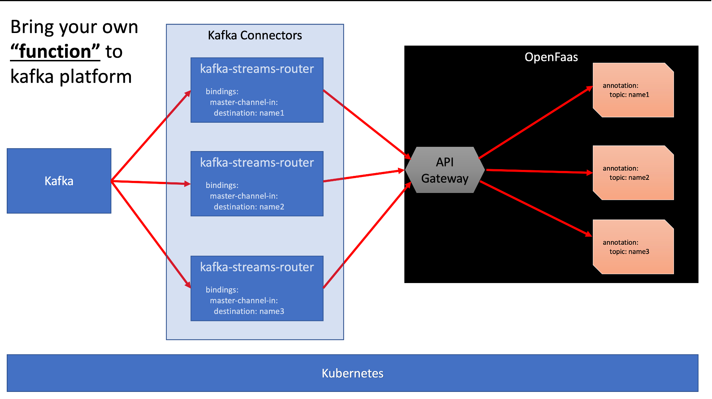

# Kafka Stream Function Router - Dynamic consumer binding

## Overview

In this blog, I will explore the programing pradim, which I call, bring your function to the kafka cluster, I DO NOT CARE,
how the message from Kafka is delivered to it. This concept will provide programming ease and enable engineers to 
think - "just function" to write business logic in the programing logic of your choice.

The serverless function as service also called "infrastructure on demand", provides simplicity,decoupling and ease in 
development. This will further, enable engineers (software/data scientist etc) to concentrate to their trait rather than 
bogged down with infrastructure challenges.

The famous cloud says "**bring your own container/notebook"**, I say "bring your function business logic". Which engineer
will not like to think software development only and no bothered by the surrounding annoyance.

The goal of this project is to create kafka connector using Spring Cloud Stream, which routes the incoming messages to
a "function" build using OpenFaas which is annotated with annotation **topic**.

Hence, it connects Kafka topics to OpenFaaS Functions. Once deployed the kafka-connector and pointing broker, user
can connect functions to topics by adding a simple annotation to a function's stack.yml file.

**_This is paid offering from OpenFaas, however, this provides open source offering. Also this project is deployable on
k8s. It uses jkube with zero k8s configuration._** The programing model demonstrate, k8s native solution with zero k8s 
yaml development -  "productivity boost"

Following picture shows the design:



## Installation

- Docker
- Kafka (http://strimzi.io)
- OpenFaas
- K8s cluster (k3d)

## Run

````
mvn k8s:build k8s:push k8s:resource k8s:apply -Pkubernetes
````

Observe log:

````
mvn k8s:log -Pkubernetes
````

## Test

To send a message to the consuming function using below REST call:

````
http://localhost:8081/router?message=magic
````

The output:

````
{
    "timestamp": 1615123388892,
    "message": "magic",
    "topicName": "master-channel",
    "boundedFunctions": [
        "python-kafka"
    ]
}
````

The message magic will be delivered to function - "python-kafka"
